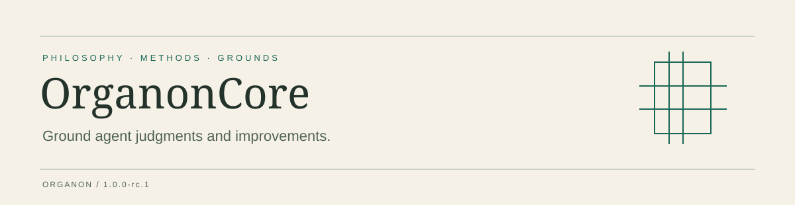

[English](README.md) · [简体中文](zh/README.md) · [Website](https://shendeguize.github.io/OrganonCore/) · [Releases](https://github.com/shendeguize/OrganonCore/releases)

# OrganonCore

The philosophy and its review methods.

## Design Aim · Ground agent judgments and improvements

Make commitments, reasons and boundaries readable, assessable and revisable. Organon supplies philosophy and methods; it does not promise correct judgments or automatic improvement. Philosophical adoption retains an explicit human decision.

The philosophy adopts **Self-Transcendence, Internal Consistency and Reflexivity**, with **Grounds** constraining the support and scope of judgments. Its philosophical version is **0.1.4**; product version **1.0.0-rc.1** identifies the installation package and site edition.

## Start here

```sh
npx --yes @shendeguize/agent-organon@1.0.0-rc.1 install --product core --agent codex --scope project --project /path/to/workspace --version 1.0.0-rc.1
```

Release candidate **1.0.0-rc.1** awaits review. Run this command once the public package is available; before publication use a local candidate archive. Requires Node.js 22+. Project and global installation are available; the release matrix records actual validation for the six agent adapters.

[Complete quick start: install → check → select philosophy → read-only assessment](https://shendeguize.github.io/OrganonCore/quick-start)

## Read and navigate

| Entry | Content |
| --- | --- |
| [AgentOrganon](https://github.com/shendeguize/AgentOrganon) | Workspace skills and management of adopted copies. |
| [OrganonCore](https://github.com/shendeguize/OrganonCore) | Core philosophy, review methods and Lean evidence. |
| [AdvisedOrganons](https://github.com/shendeguize/AdvisedOrganons) | Domain philosophy collection; select a domain explicitly. |
| [Docs](https://shendeguize.github.io/OrganonCore/understand) | Concepts, operations and capability boundaries for readers. |
| [Philosophy](https://shendeguize.github.io/OrganonCore/philosophy) | Adopted commitments with their meanings and conditions. |
| [Lean](https://shendeguize.github.io/OrganonCore/lean) | Claim overviews and paired code with line explanations. |

Release packages contain philosophy, non-Lean skills and required runtime files. Websites, tutorials, Lean projects and evidence remain in source. Rationale is separate from reader documentation and adds no philosophical obligations; maintenance protocols live in maintenance.


## Choose a method

| Method | Purpose |
| --- | --- |
| `organon-core-assess` | Assess an input under the selected philosophy. |
| `organon-core-absorb` | Examine reasons for philosophical revision and carry out authorized adoption. |
| `organon-core-principled-review` | Analyze an object under the shared method’s stated standards. |
| `organon-core-wording-review` | Review wording without deciding philosophical adoption. |

## Star history


Daily observations begin when collection is enabled. Zero totals, unstars and missing samples are retained; the chart reports its update time.

## Contribute

Read the repository’s agent guidance and maintenance protocols before contributing. Mechanical checks, independent review and human adoption decisions have distinct responsibilities.

MIT · [License](LICENSE)
